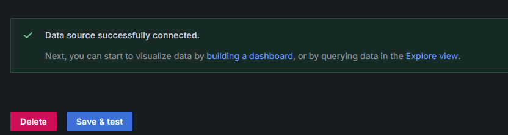
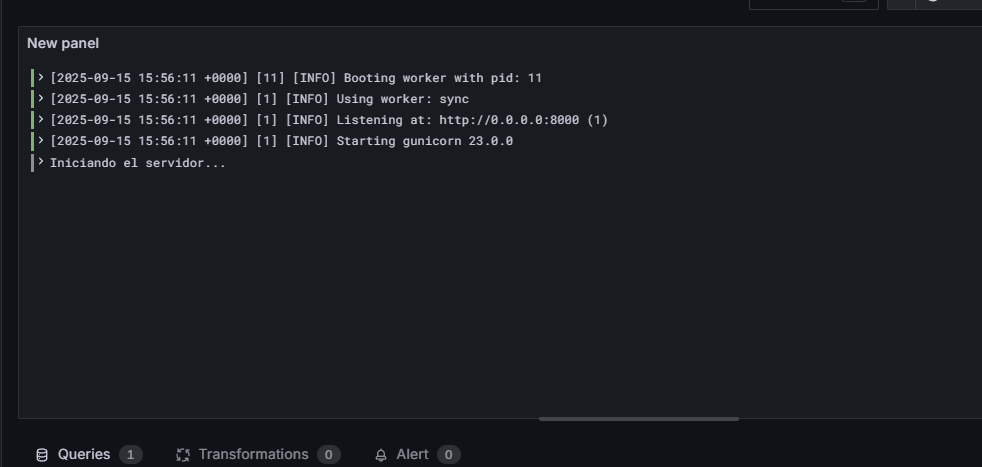
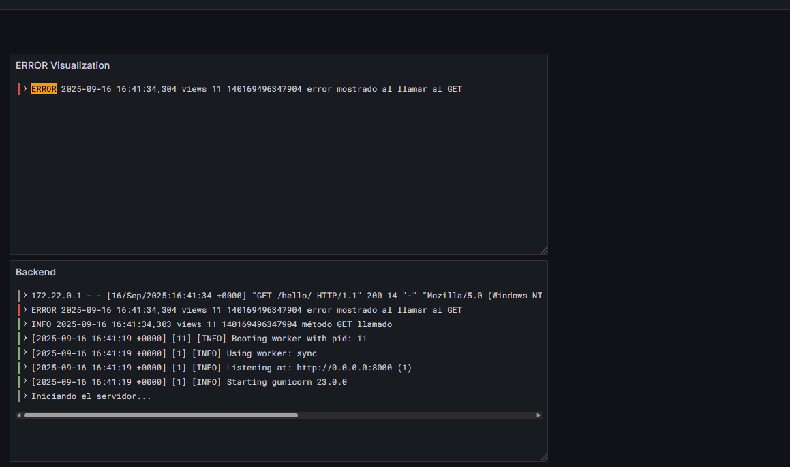

# Grafana with Loki and Django

This repo shows how to deploy an infrastructure with Django in backend and manage its logs with Grafana and Loki

## Content Table

- [Grafana with Loki and Django](#grafana-with-loki-and-django)
  - [Content Table](#content-table)
  - [Installation](#installation)
  - [First Login](#first-login)
  - [Configure Loki Service as a data source](#configure-loki-service-as-a-data-source)
  - [Create a Dashboard with visualization](#create-a-dashboard-with-visualization)
  - [Filtering queries](#filtering-queries)

## Installation

1. Clone repo

   ```bash
    git clone https://github.com/miguelanguai/django-loki-grafana-logging
   ```

2. Start docker compose with `docker compose up -d`

## First Login

When you first login, you can enter admin dashboard with admin as user and password. Then, you will be requested to change the password.

After that, you will arrive to admin dashboard

## Configure Loki Service as a data source

1. Go to Connection tab
2. `Add new data source`
3. Filter by `Loki`
4. Name it as `Loki` and put `http://loki:3100` on Connection URL input.
5. Save & Test. Following image must appear

    

## Create a Dashboard with visualization

Now, let's create a dashboard with logs visualization:

1. Go to Dashboard tab
2. `New`
3. `New dashboard`
4. `Add visualization`
5. Choose `Loki` as data source
6. On `label filters`, select service_name as label and `backend` as value (backend is the name of the service on the compose)
7. Click on `Run query`
8. Open visualization suggestions and choose the first one.
9. It should look like this

    

## Filtering queries

Now, with the same query we created, we can create a filtering, as we, for example, only want WARNING logs from our backend service.

1. On the same query, click on `Operations`
2. Line filters/Line contains `ERROR`
3. `Run query`
4. Choose the first suggested visualization

  
